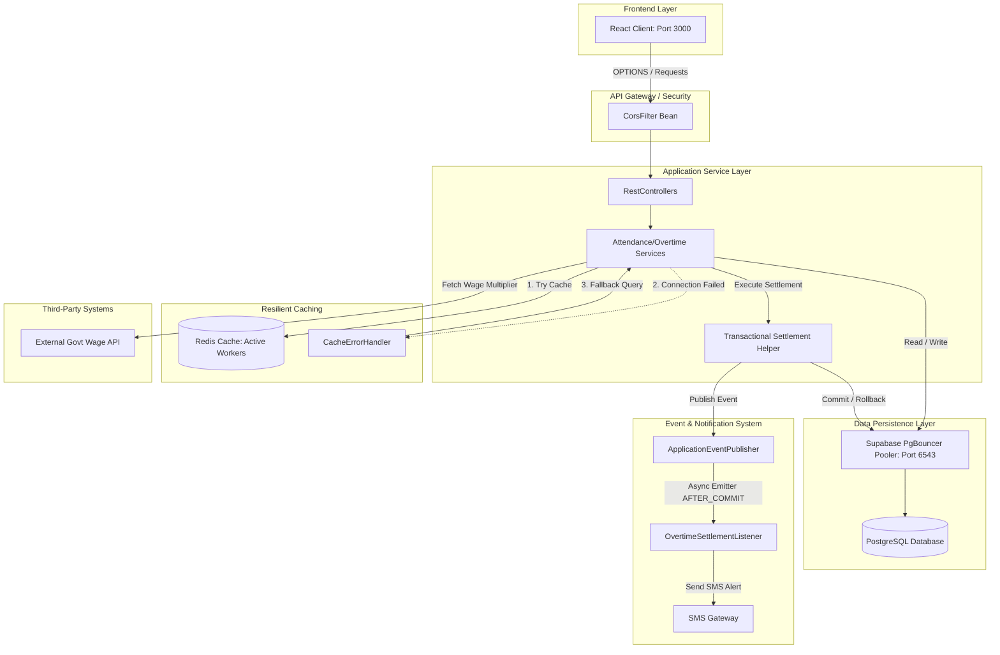
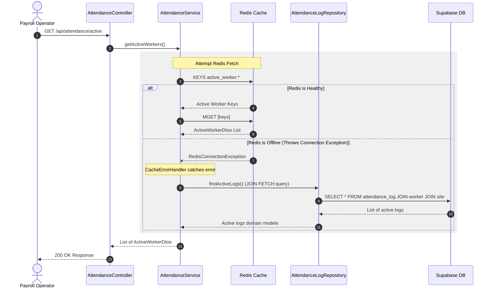

# Construction HRMS: Schema Design, HLD, and LLD

This document outlines the architectural blueprints for the Construction HRMS Attendance & Overtime Settlement Engine, breaking down the database model (Schema), system interaction pathways (HLD), and component logic boundaries (LLD).

---

## 🗄️ 1. Database Schema Design

The schema is built to support rapid check-ins, tracking, and resilient, audit-safe overtime settlements.

### Entity-Relationship Diagram (ERD)

```mermaid
erDiagram
    WORKER {
        Long id PK "worker_sequence"
        String name "NOT NULL"
        String phone UK "NOT NULL"
        String designation "Enum (MASON, etc)"
        BigDecimal daily_wage_rate "10,2 NOT NULL"
        boolean active "DEFAULT true"
    }

    SITE {
        Long id PK "site_sequence"
        String site_name "NOT NULL"
        String location "NOT NULL"
        boolean active "DEFAULT true"
    }

    ATTENDANCE_LOG {
        Long id PK "attendance_log_sequence"
        Long worker_id FK "NOT NULL"
        Long site_id FK "NOT NULL"
        timestamp clock_in "NOT NULL"
        timestamp clock_out "NULLABLE"
        Double total_hours "NULLABLE"
        Double overtime_hours "NULLABLE"
        boolean flagged "DEFAULT false"
    }

    OVERTIME_ENTRY {
        Long id PK "overtime_entry_sequence"
        Long worker_id FK "NOT NULL"
        Long attendance_id FK UK "NOT NULL"
        date date "NOT NULL"
        Double overtime_hours "NOT NULL"
        BigDecimal overtime_rate_applied "10,2 NOT NULL"
        BigDecimal amount "10,2 NOT NULL"
        String settlement_status "Enum (PENDING, SETTLED)"
        String month "Format YYYY-MM"
    }

    WORKER ||--o{ ATTENDANCE_LOG : "clocks in/out"
    SITE ||--o{ ATTENDANCE_LOG : "hosts"
    WORKER ||--o{ OVERTIME_ENTRY : "earns"
    ATTENDANCE_LOG ||--o| OVERTIME_ENTRY : "spawns"
```

### Database Performance Indexes & Constraints

To ensure $O(1)$ and $O(\log N)$ query times under high concurrent supervisor activity:

1. **`worker` Table**:
   - **Constraint**: `UNIQUE(phone)` - Prevents duplicate profiles.
   - **Index**: `idx_worker_active (active)` - Accelerates filtering active workforces.
2. **`site` Table**:
   - **Index**: `idx_site_active (active)` - Optimizes queries for active construction spots.
3. **`attendance_log` Table**:
   - **Index**: `idx_attendance_worker_clockin (worker_id, clock_in)` - Rapidly pulls log histories.
   - **Index**: `idx_attendance_worker_clockout (worker_id, clock_out)` - Finds active clock-ins.
4. **`overtime_entry` Table**:
   - **Constraint**: `UNIQUE(attendance_id)` - Prevents duplicate overtime payouts for the same shift.
   - **Index**: `idx_overtime_worker_month (worker_id, month)` - Optimizes monthly wage settlement fetches.
   - **Index**: `idx_overtime_worker_status (worker_id, settlement_status)` - Rapidly pulls pending liabilities.

---

## 🏛️ 2. High-Level Design (HLD)

The HLD illustrates the end-to-end system topology, tracing request pathways, caching topologies, and event boundaries.



### High-Level Interaction Workflows

#### A. Worker Clock-In Flow
1. **Request**: Supervisor clocks in a worker.
2. **CORS Guard**: Request passes origin matching check.
3. **Database Check**: Service verifies worker and site exist and are active.
4. **Open Log Check**: Ensures no existing open logs (no active clock-ins).
5. **Persistence**: Saves new `AttendanceLog` to PostgreSQL.
6. **Cache Populate**: Saves metadata to Redis (`active_worker:workerId`) with a **16-Hour TTL**.

#### B. Monthly Overtime Settlement Flow (resilient & non-blocking)
1. **Request**: Payroll operator requests settlement for a worker + month.
2. **Validation**: Check that the targeted month has fully passed.
3. **External Fetch (OUTSIDE Transaction)**: Call the Gov API for multipliers. Takes ~3 seconds; running it here keeps database connections free.
4. **Transactional Helper (INSIDE Transaction)**:
   - Acquires connection, updates `overtime_entry` records to `SETTLED`, computes payout adjustments.
   - Publishes `OvertimeSettledEvent`.
   - Commits transaction.
5. **Post-Commit Event (OUTSIDE Transaction)**:
   - The transaction listener receives the event only **AFTER** database persistence.
   - Triggers async SMS. If the SMS fails, the database remains committed.

---

## 💻 3. Low-Level Design (LLD)

LLD specifies package layouts, class interactions, and boundary definitions.

### Sequence Diagram: Resilient Active Worker Lookup (Redis Outage Fallback)

This diagram shows how the system recovers when Redis is offline:



### Class Responsibility & Boundaries

*   **`AttendanceService`**: Coordinates clock-ins/outs, flags overtime shifts, and manages cache synchronization.
*   **`OvertimeService`**: Orchestrates settlements, validates periods, and invokes the transaction helper.
*   **`OvertimeSettlementTransactionHelper`**: Isolation bean containing the `@Transactional` boundary to guarantee all-or-nothing database writes.
*   **`OvertimeSettlementListener`**: Separates the transaction from notification channels by listening to `TransactionPhase.AFTER_COMMIT`.

---

## 💡 Key Low-Level Engineering Solutions

### 1. N+1 Query Resolution
By default, Hibernate fetch strategies cause $O(N)$ query loops when mapping relationships. The `AttendanceLogRepository` utilizes explicit `JOIN FETCH` directives:
```java
@Query("SELECT a FROM AttendanceLog a JOIN FETCH a.worker JOIN FETCH a.site WHERE a.clockOut IS NULL")
List<AttendanceLog> findActiveLogs();
```
This forces SQL to run a single `INNER JOIN` in one roundtrip, converting the lookup cost to $O(1)$.

### 2. Post-Commit Event listener
Decoupling notifications prevents side effects from breaking atomic ledger writes:
```java
@TransactionalEventListener(phase = TransactionPhase.AFTER_COMMIT)
public void handleOvertimeSettlement(OvertimeSettledEvent event) {
    // Fired only when data is committed to disk
    smsService.sendSmsForSettlement(...);
}
```
